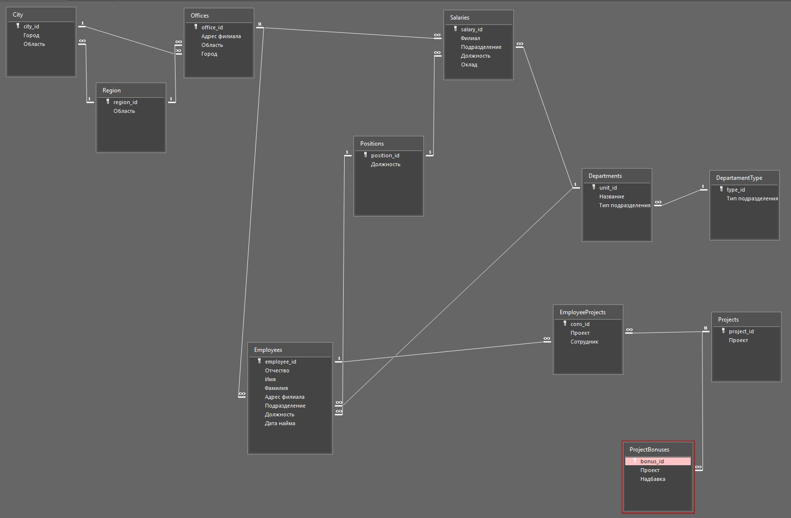

# Домашнее задание к занятию «Базы данных» - Растегаев И.О.

---

### Задание 1

Данные числовые, текстовые.
В частности:
1. DATE
2. SMALLINT
3. CHAR
4. TINYTEXT

---

### Задание 2

Изобразил в MS Access. Вообще не уверен в правильности, т.к. не получилось выполнить запрос с суммой общего оклада от офиса\подразделения\должности и бонуса от участия в проектах (как я понял, в вашей таблице один сотрудник может быть закреплен за несколькими проектами?)

