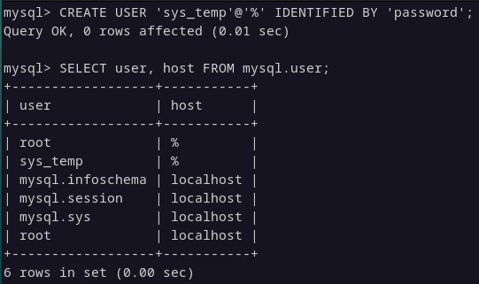
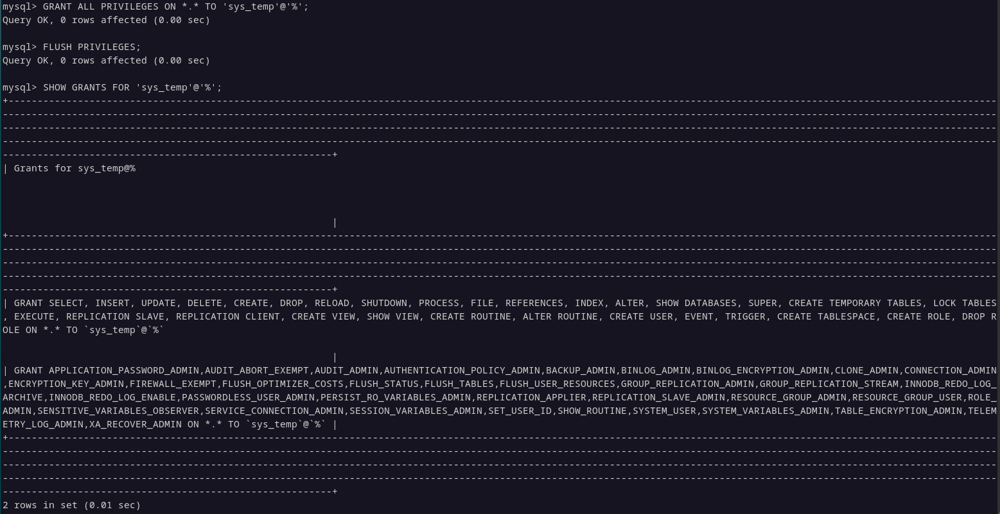
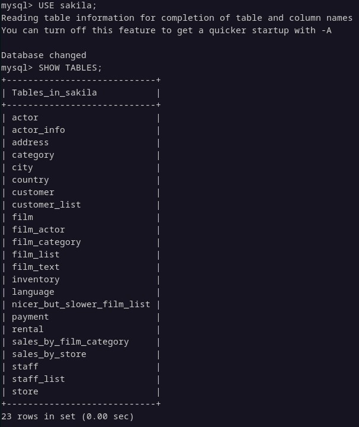
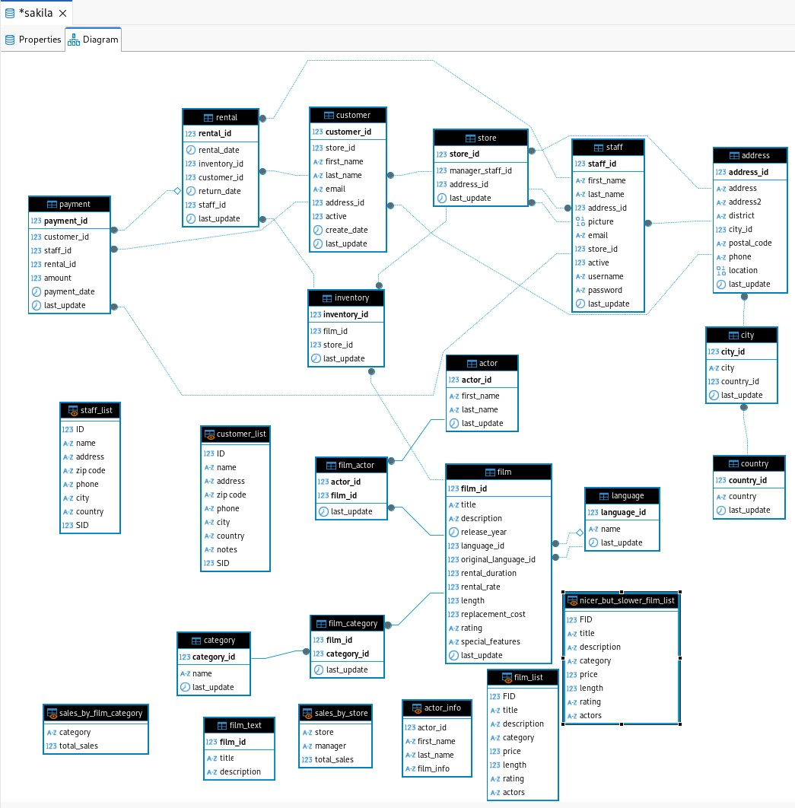
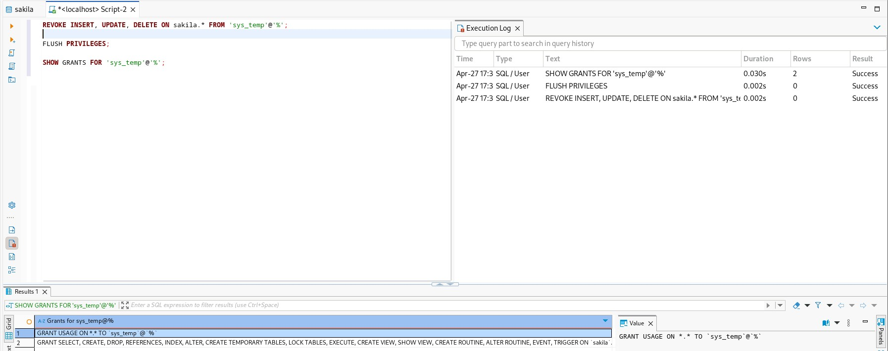

# Домашнее задание к занятию «Работа с данными (DDL/DML)» - Растегаев И.О.

---

### Задание 1

1. Создание учетной записи sys_temp и получение списка пользователей в БД.

2. Делегирование всех прав пользователю sys_temp и запрос на получение прав пользователя.

3. Восстановление дампа БД и show tables.

Диаграмма из DBeaver.

---

### Задание 2

Таблица с ключами.

| Название таблицы  | Название первичного ключа |
| ------------- | ------------- |
| custumer  | custumer_id  |
| store  | store_id  |
| staff  | staff_id  |
| address  | address_id  |
| city  | city_id  |
| country  | country_id  |
| rental  | rental_id  |
| payment  | payment_id  |
| intentory  | intentory_id  |
| actor  | actor_id  |
| film  | film_id  |
| language  | language_id  |
| category  | category_id  |
| intentory  | intentory_id  |

---

### Задание 3

Отзываем права на внесение, изменение и удаление у sys_temp в базе sakila.

