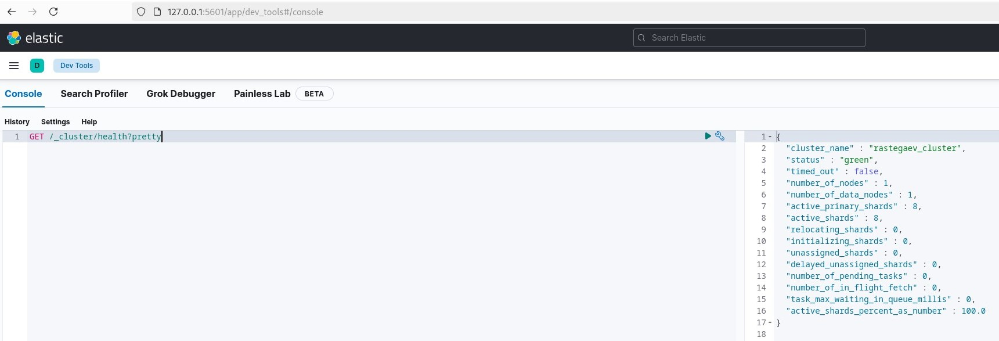

# Домашнее задание к занятию «ELK» - Растегаев И.О.

---

### Задание 1

Запуск Elasticsearch в контейнере с кастомным cluster_name.

---

### Задание 2

Результат выполнения GET в Kibana.

---

### Задание 3

Логи Nginx собранные через Logstash.

---

### Задание 4

Логи Nginx собранные через Filebeat.

