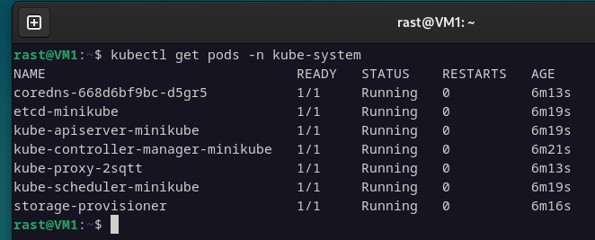
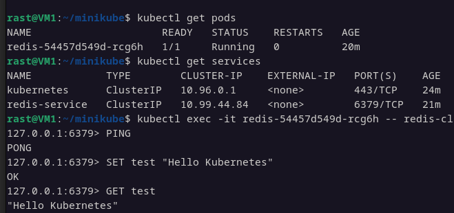

# Домашнее задание к занятию «Kubernetes. Часть 1»  - `Растегаев И.О.`

---

### Задание 1

Использовал Docker.
Результа выполнения команды kubectl get po -n kube-system.

---

### Задание 2

Запуск Deployment и Service.
Скриншот с взаимодействием и конфиг Deployment.

[Конфиг Deployment](ex2/redis-deployment.yaml)

---

### Задание 3

text.

---

### Задание 4

text.

