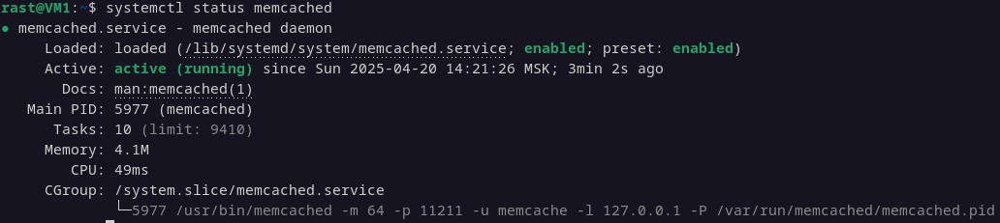
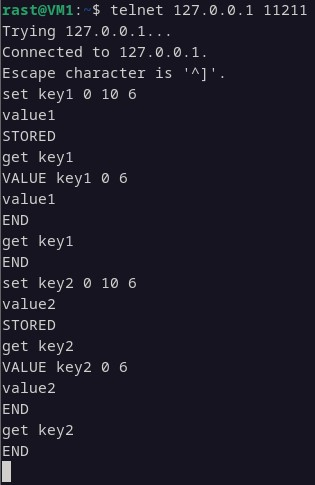
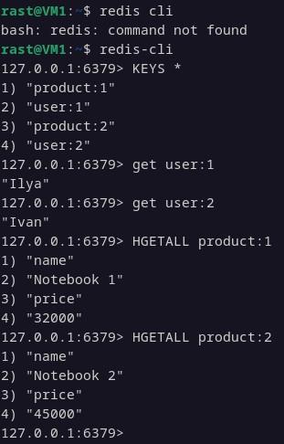
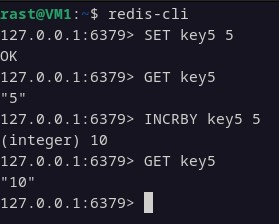

# Домашнее задание к занятию «Кеширование Redis/memcached» - Растегаев И.О. ``

---

### Задание 1

1. Частые запросы к БД (например, популярные товары в интернет-магазине) создают нагрузку и увеличивают время отклика.
2. Один и тот же контент (лента новостей, профиль пользователя) запрашивается многократно. 
3. Сложные расчеты.

---

### Задание 2

Статус memcached.

---

### Задание 3

Пришлось выставить значение 10, слишком быстро удалялись.

---

### Задание 4

Записанные ключи в Redis.

---

### Задание 5

Увеличение значения key5 на 5.

