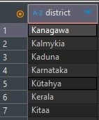
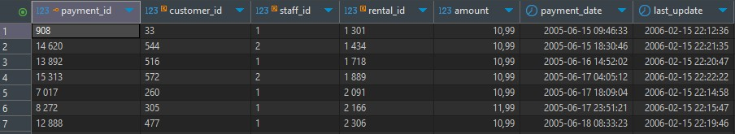
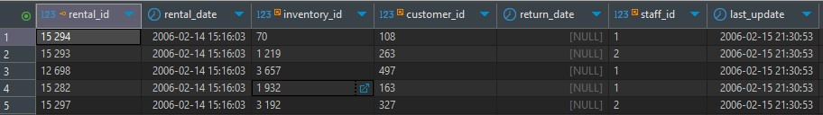
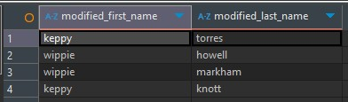
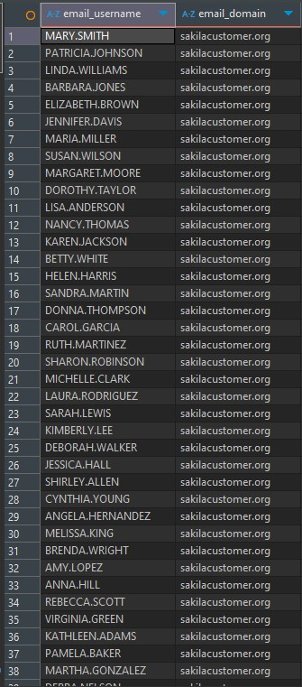
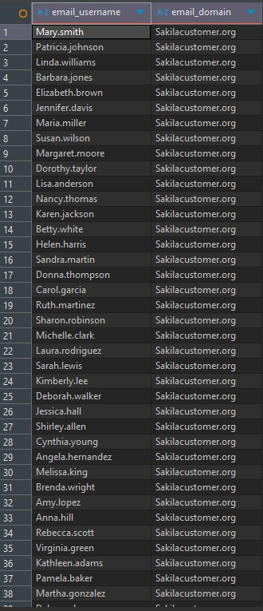

# SQL. Часть 1 - Растегаев И.О.

---


### Задание 1


Уникальные названия районов столбца "disctrict" из таблицы "address", которые начинаются на “K” и заканчиваются на “a” и не содержат пробелов.

```
SELECT DISTINCT district
FROM address
WHERE district LIKE 'K%a' 
  AND district NOT LIKE '% %'
  AND district NOT LIKE '';
```



---

### Задание 2


Платежи, которые выполнялись в промежуток с 15 июня 2005 года по 18 июня 2005 года включительно и стоимость которых превышает 10.00.

```
SELECT *
FROM payment
WHERE payment_date BETWEEN '2005-06-15 00:00:00' AND '2005-06-18 23:59:59'
  AND amount > 10.00
ORDER BY payment_date;
```




---

### Задание 3


Последние пять аренд фильмов.

```
SELECT *
FROM rental
ORDER BY rental_date DESC 
LIMIT 5;
```



---

### Задание 4


Запрос активных покупателей, имена которых Kelly или Willie.
1) Все буквы в фамилии и имени из верхнего регистра переведены в нижний регистр,
2) Произведена замена букв 'll' в именах на 'pp'.

```
SELECT 
    REPLACE(LOWER(first_name), 'll', 'pp') AS modified_first_name,
    LOWER(last_name) AS modified_last_name
FROM 
    customer
WHERE 
    active = 1
    AND (first_name = 'Kelly' OR first_name = 'Willie');
```



---

### Задание 5


Email каждого покупателя, с разделенным значением Email на две отдельных колонки.

```
SELECT 
    SUBSTRING_INDEX(email, '@', 1) AS email_username,
    SUBSTRING_INDEX(email, '@', -1) AS email_domain
FROM 
    customer;
```



---

### Задание 6


Доработанный запрос из "Задания 5", с изменением первых букв на заглавные.

```
SELECT 
    CONCAT(
        UPPER(SUBSTRING(SUBSTRING_INDEX(email, '@', 1), 1, 1)),
        LOWER(SUBSTRING(SUBSTRING_INDEX(email, '@', 1), 2))
    ) AS email_username,
    CONCAT(
        UPPER(SUBSTRING(SUBSTRING_INDEX(email, '@', -1), 1, 1)),
        LOWER(SUBSTRING(SUBSTRING_INDEX(email, '@', -1), 2))
    ) AS email_domain
FROM 
    customer;
```

