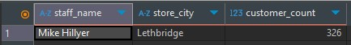
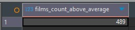
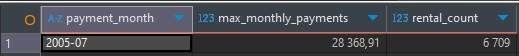
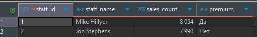
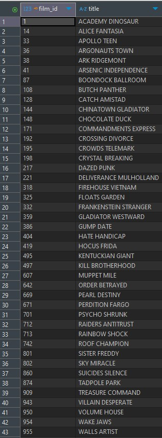

# SQL. Часть 2 - Растегаев И.О.

---


### Задание 1


Информация о магазине, в котором обслуживается более 300 покупателей.

1) Фамилия и имя сотрудника из этого магазина;
2) Город нахождения магазина;
3) Количество пользователей, закреплённых в этом магазине.

```
SELECT 
    CONCAT(s.first_name, ' ', s.last_name) AS staff_name,
    c.city AS store_city,
    COUNT(cu.customer_id) AS customer_count
FROM 
    store st
JOIN 
    staff s ON st.manager_staff_id = s.staff_id
JOIN 
    address a ON st.address_id = a.address_id
JOIN 
    city c ON a.city_id = c.city_id
JOIN 
    customer cu ON st.store_id = cu.store_id
GROUP BY 
    st.store_id, s.staff_id, c.city_id
HAVING 
    COUNT(cu.customer_id) > 300;

```



---

### Задание 2


Количество фильмов, продолжительность которых больше средней продолжительности всех фильмов.

```
SELECT COUNT(*) AS films_count_above_average
FROM film
WHERE length > (SELECT AVG(length) FROM film);

```




---

### Задание 3


Информация, за какой месяц была получена наибольшая сумма платежей, и количество аренд за этот месяц.

```
WITH monthly_stats AS (
    SELECT 
        DATE_FORMAT(p.payment_date, '%Y-%m') AS payment_month,
        SUM(p.amount) AS total_amount,
        COUNT(DISTINCT p.rental_id) AS rental_count
    FROM 
        payment p
    GROUP BY 
        payment_month
    ORDER BY 
        total_amount DESC
    LIMIT 1
)
SELECT 
    payment_month,
    total_amount AS max_monthly_payments,
    rental_count
FROM 
    monthly_stats;

```




---

### Задание 4

Количество продаж, выполненных каждым продавцом. Добавлена вычисляемая колонка «Премия». Если количество продаж превышает 8000, то значение в колонке «Да», иначе «Нет».

```
SELECT 
    s.staff_id,
    CONCAT(s.first_name, ' ', s.last_name) AS staff_name,
    COUNT(p.payment_id) AS sales_count,
    CASE 
        WHEN COUNT(p.payment_id) > 8000 THEN 'Да'
        ELSE 'Нет'
    END AS premium
FROM 
    payment p
JOIN 
    staff s ON p.staff_id = s.staff_id
GROUP BY 
    s.staff_id, s.first_name, s.last_name
ORDER BY 
    sales_count DESC;

```



---

### Задание 5


Фильмы, которые ни разу не брали в аренду.

```
SELECT f.film_id, f.title
FROM film f
LEFT JOIN inventory i ON f.film_id = i.film_id
LEFT JOIN rental r ON i.inventory_id = r.inventory_id
WHERE r.rental_id IS NULL;

```



---

