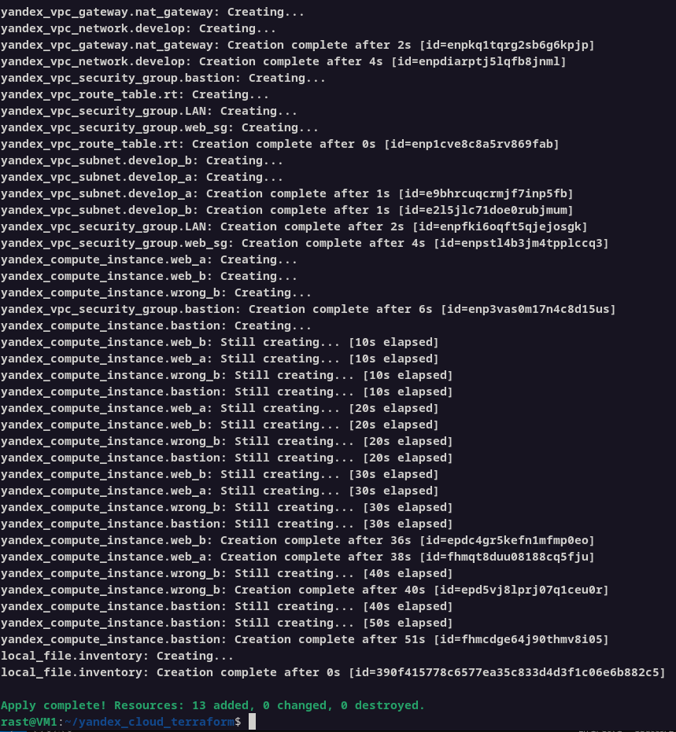
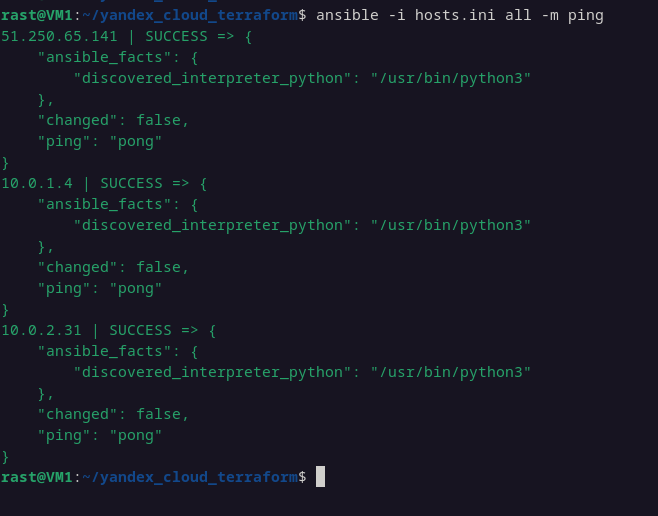
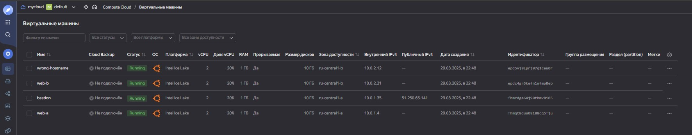
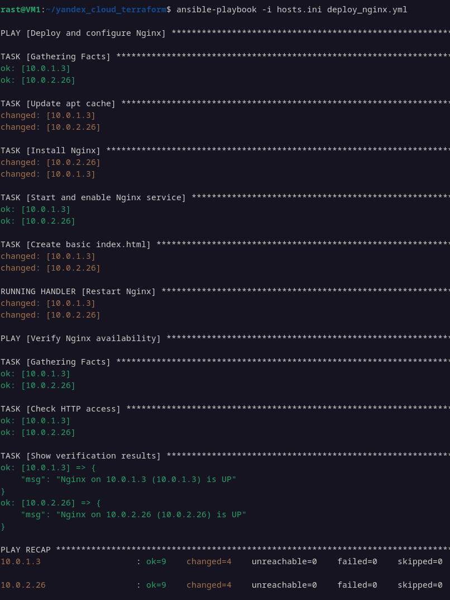
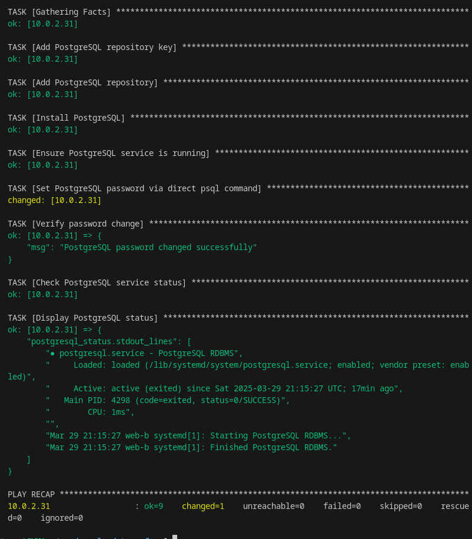

#  Домашнее задание к занятию «Подъём инфраструктуры в Yandex Cloud» - `Растегаев И.О.`

---

### Задание 1

Развертывание инфраструктуры в Yandex Cloud с помощью Terraform.

---

### Задание 2

Деплой nginx на двух ВМ.

---

### Задание 3

Деплой PostgreSQL на одной из ВМ.

